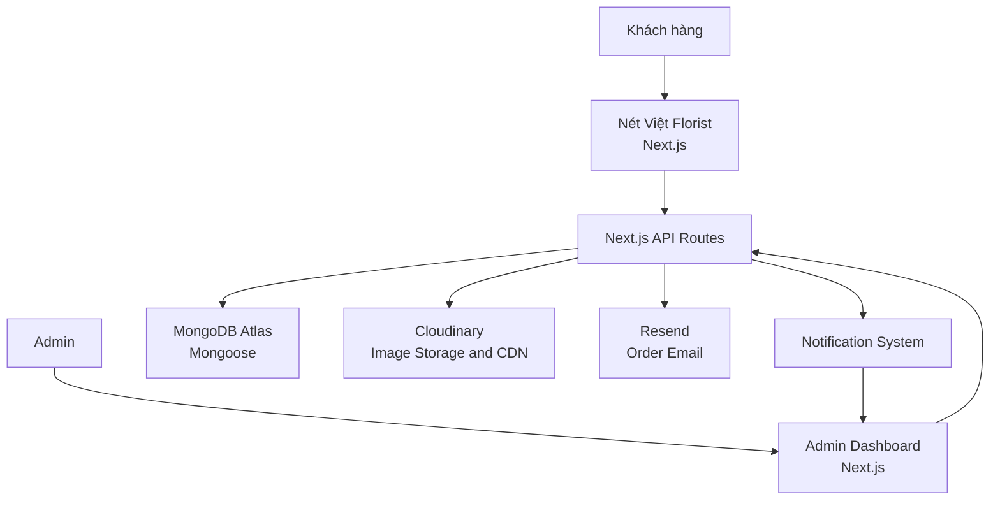
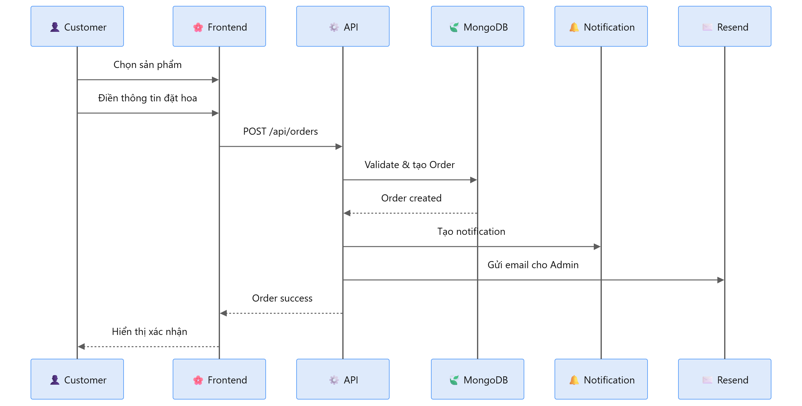

# Nét Việt Florist

<p align="center">
  
  
  
  
  
  
  
  
</p>

---

## Giới thiệu

**Nét Việt Florist** là website đặt hoa trực tuyến được xây dựng cho một cửa hàng hoa tại Phan Thiết.

Website cho phép khách hàng xem sản phẩm, tìm kiếm theo danh mục và gửi yêu cầu đặt hoa trực tuyến. Hệ thống cũng cung cấp **Admin Dashboard** để quản lý sản phẩm, danh mục, đơn đặt hoa và thông báo.

Dự án được xây dựng với mục tiêu đưa quy trình bán hoa truyền thống lên nền tảng trực tuyến và hỗ trợ cửa hàng quản lý đơn hàng tập trung hơn.

---

## Tech Stack

| Layer              | Technology                         | Purpose                                               |
| :----------------- | :--------------------------------- | :---------------------------------------------------- |
| **Frontend**       | `Next.js`, `React`, `TypeScript`   | Xây dựng giao diện khách hàng và Admin Dashboard      |
| **Styling**        | `Tailwind CSS 4`                   | Responsive UI và styling                              |
| **UI & Animation** | `Framer Motion`, `Lucide React`    | Hiệu ứng chuyển động và icon                          |
| **Backend**        | `Next.js API Routes`               | Xử lý API và business logic                           |
| **Database**       | `MongoDB Atlas`, `Mongoose`        | Lưu trữ sản phẩm, danh mục, đơn hàng và notifications |
| **Image Storage**  | `Cloudinary`, `Sharp`, `file-type` | Kiểm tra, xử lý, chuyển đổi WebP và lưu trữ hình ảnh  |
| **Email**          | `Resend`                           | Gửi email thông báo đơn đặt hoa                       |
| **Deployment**     | `Vercel`                           | Deploy và hosting ứng dụng                            |

---

## Features

### Customer

- Xem danh sách sản phẩm hoa
- Tìm kiếm và lọc sản phẩm
- Xem sản phẩm theo danh mục
- Xem chi tiết sản phẩm
- Gửi yêu cầu đặt hoa trực tuyến
- Nhập thông tin liên hệ, địa chỉ giao hàng, ngày giao, dịp tặng, số lượng và ghi chú
- Xem câu hỏi thường gặp
- Responsive trên Desktop, Tablet và Mobile

### Admin

- Admin Dashboard
- Quản lý sản phẩm
- Quản lý danh mục
- Quản lý đơn đặt hoa
- Upload, chỉnh sửa và quản lý hình ảnh sản phẩm
- Tìm kiếm và lọc đơn hàng, sản phẩm
- Nhận thông báo khi có yêu cầu đặt hoa mới
- Đánh dấu thông báo đã đọc và xóa thông báo

### Infrastructure & Performance

- Lưu trữ và phân phối ảnh qua Cloudinary CDN
- Kiểm tra loại file thực tế, kích thước và kích thước ảnh trước khi upload
- Dùng Sharp để giải mã, resize và xuất ảnh WebP trước khi lưu
- Gửi email thông báo đơn hàng qua Resend
- Cấu hình thông tin kết nối bằng environment variables

---

## Architecture



## Luồng Đặt Hoa



## Project Structure

```text
netviet/
├── app/
│   ├── (backend)/api/        # API route handlers
│   ├── (frontend)/           # Customer and admin pages
│   ├── globals.css
│   └── layout.tsx
├── components/               # Shared UI and admin components
├── hooks/                    # Reusable React hooks
├── lib/                      # Database, Cloudinary, email and API helpers
├── models/                   # Mongoose models
├── public/                   # Static images and assets
├── scripts/                  # Data seeding scripts
├── types/                    # Shared TypeScript types
├── .env.local                 # Local secrets; do not commit
├── next.config.ts
├── package.json
└── README.md
```

## Security

- Việc gửi yêu cầu đặt hoa được kiểm tra dữ liệu bằng **Zod** và áp dụng **rate limiting** để hạn chế spam.

- Các API sản phẩm, đơn hàng và thông báo đều kiểm tra **MongoDB ObjectId** khi cần thiết.

- File hình ảnh upload được kiểm tra **định dạng thực tế**, giới hạn kích thước tối đa **5 MB** và kiểm tra kích thước ảnh.

- **Sharp** giải mã, resize và chuyển đổi hình ảnh được upload sang **WebP** trước khi gửi lên Cloudinary.

- Thông tin xác thực của database và các dịch vụ bên ngoài được đọc từ **server environment variables**. Không đưa các thông tin này vào client code hoặc commit lên Git.

- Trang đăng nhập Admin hiện tại chỉ là **UI placeholder** và chưa thực hiện xác thực người dùng. Cần bổ sung **authentication và authorization** cho các trang Admin và Admin API trước khi sử dụng thực tế.

## Getting Started

### 1. Clone repository

```bash
git clone <YOUR_REPOSITORY_URL>
cd netviet-florist
```

### 2. Install dependencies

```bash
npm install
```

### 3. Configure environment variables

Create a `.env` file in the project root. Do not commit it:

```dotenv
MONGODB_URI=your_mongodb_uri

CLOUDINARY_CLOUD_NAME=your_cloud_name
CLOUDINARY_API_KEY=your_api_key
CLOUDINARY_API_SECRET=your_api_secret

RESEND_API_KEY=your_resend_api_key
ADMIN_EMAIL=your_admin_email
```

### 4. Run development server

```bash
npm run dev
```

Open `http://localhost:3000` in your browser.

## Developer

### Phan Hoàng Khang

Built with ❤️ for Nét Việt Florist.
